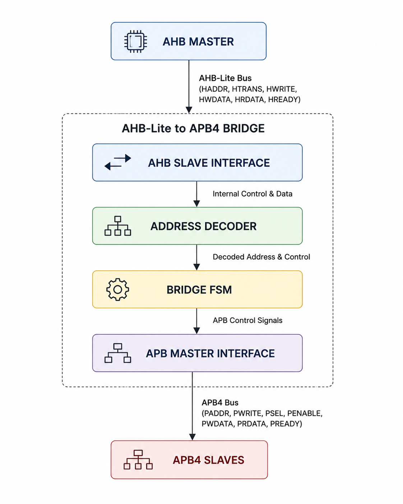
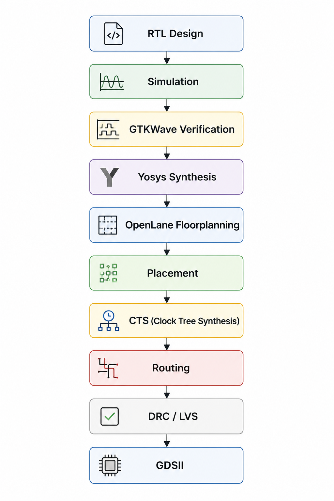

# AHB-Lite to APB4 Bridge IP

> RTL-to-GDSII implementation of an AHB-Lite to APB4 Bridge IP using the OpenLane/OpenROAD ASIC flow on the Sky130 technology.

---

## Project Overview

This project presents the complete design and ASIC implementation of an AHB-Lite to APB4 Bridge IP written in SystemVerilog.

The bridge converts high-speed AHB-Lite transactions into APB4 peripheral transactions while following the AMBA protocol. The design was functionally verified using simulation and GTKWave before being synthesized and implemented through the complete RTL-to-GDSII ASIC flow using OpenLane/OpenROAD targeting the Sky130 standard-cell technology.

---

## Key Features

- AMBA AHB-Lite to APB4 protocol conversion
- Modular RTL architecture
- Address decoding for APB slave selection
- Bridge finite state machine (FSM)
- APB master interface generation
- Functional verification using Icarus Verilog and GTKWave
- Logic synthesis using Yosys
- Physical implementation using OpenLane/OpenROAD
- Final GDSII generation on Sky130

---

## Architecture

<p align="center">

</p>

---

## ASIC Design Flow

<p align="center">

</p>

---

## Directory Structure

```text
.
├── rtl/
├── tb/
├── docs/
├── reports/
├── openlane/
├── scripts/
├── images/
├── README.md
└── Makefile
```

---

## Tools Used

| Tool | Purpose |
|------|---------|
| SystemVerilog | RTL Design |
| Icarus Verilog | Simulation |
| GTKWave | Waveform Verification |
| Yosys | Logic Synthesis |
| OpenLane | RTL-to-GDSII Flow |
| OpenROAD | Physical Design |
| Magic | Layout Verification |
| KLayout | GDSII Visualization |
| Sky130 PDK | ASIC Technology |

---

## Project Status

- ✔ RTL Design
- ✔ Functional Verification
- ✔ GTKWave Validation
- ✔ Logic Synthesis
- ✔ Floorplanning
- ✔ Placement
- ✔ Clock Tree Synthesis
- ✔ Routing
- ✔ DRC/LVS
- ✔ GDSII Generation

---

## Author

**Chinmay Devaramani**

Electronics & Communication Engineering

GitHub: https://github.com/chinmay-gith
